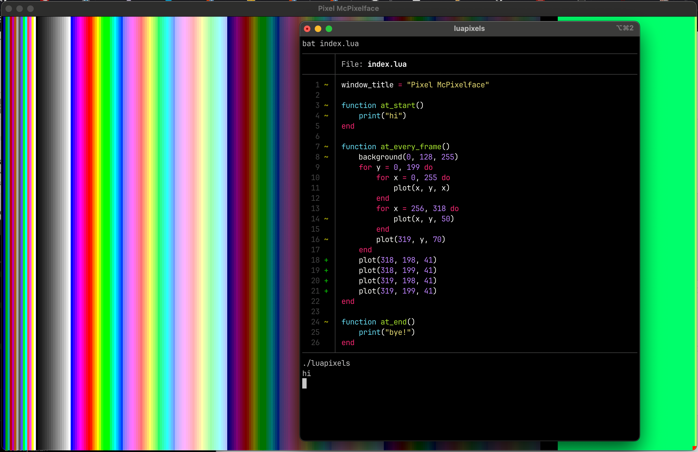

# luapixels

The beginnings of what could be a game engine for using GLFW + Go + Lua.



### Example use

main.go:

```go
package main

import (
    "log"

    "github.com/xyproto/luapixels"
)

func main() {
    if err := luapixels.RunFile("game.lua"); err != nil {
        log.Fatalln(err)
    }
}
```

game.lua:

```lua
window_title = "Simple Example"

function at_start()
    print("hi")
    -- Set color at palette index 7 to red (RGB 255, 0, 0)
    setpal(7, 255, 0, 0)
end

function at_every_frame()
    -- Set the background color to blue (RGB 0, 128, 255)
    background(0, 128, 255)
    -- At (100, 100), draw a red pixel (index 7 in the palette)
    plot(100, 100, 7)
end

function at_keypress()
    quit()
end

function at_end()
    print("bye!")
end
```

### Performance

There is a lot of room for improvements when it comes to performance, since this implementation is fresh and not yet optimized.

The pixels are quads right now, but a texture could be used instead. This would require no changes from the Lua code, though.

### General info

* License: BSD-3
* Version: 0.0.0
